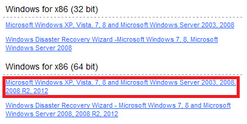

## #2.1 Install or Update Avamar Client Windows

* Open a web browser and type your Avamar Server URL.

* In our case, it’s: [http://exosafe.exoscale.ch]

* Scroll down and then click on Documents and Downloads hyperlink.

* Under "Windows for x86" (32 bit or 64 bit)

* Click on the related link to proceed, as shown below (64 bit for instance )

On the list, select "AvamarClient-windows-x86" link to download the file

* Once it’s downloaded, launch the setup and follow instructions provided via the wizard.

* Click "Next" 

Avamar client requires less than 20MB for full installation,click on "Next" button

When you're ready, start to begin the installation by clicking on "Install".

Once installation finished, click "ok" to close the wizzard 

N.B.: If you're trying to update your Avamar Client, wizard will ask you to close the current running application

* Avamar setup will have to close the current Avamar client

* Click on Ok button

Click on Finish button to close the wizard

[http://exosafe.exoscale.ch]: http://exosafe.exoscale.ch
