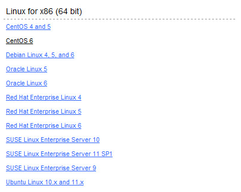
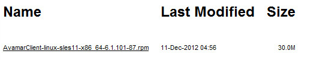
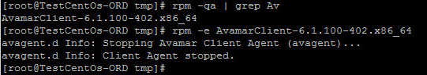
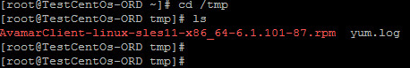
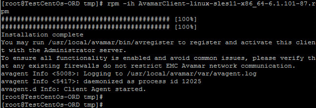
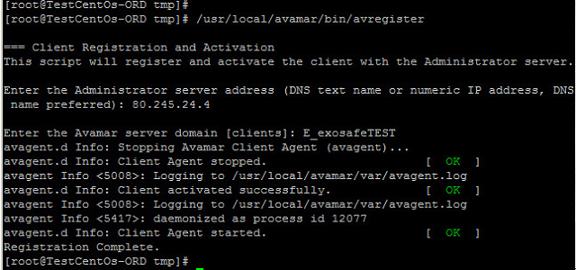
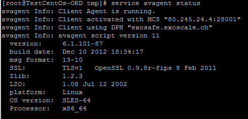

## #2.2 Install or Update Avamar Linux Client

* Open a web browser and type your Avamar Server URL.

* In our case, it’s: [http://exosafe.exoscale.ch]

* Scroll down and then click on Documents and Downloads hyperlink.

* Select your Linux distribution. (for instance CentOS 6)

Click on "AvamarClient-linux" link to download the file

Uninstall any previous version of Avamar Client for Linux software before you install the new version

* "rpm –qa | grep Av" show the name of current Avamar package

* "rpm –e AvamarClient-#" (replace # by the Avamar version) to uninstall the package

For Ubuntu distribution:

* dpkg –list | grep Av

* dpkg – P AvamarClient-Version

Add the new package in tmp folder

* Install the Client Avamar on your virtual machine

* "rpm –ih AvamarClient.rpm" to install Linux Client

Commands for Ubuntu "dpkg –I AvamarLinux.deb"

* To register and activate the client with Avamar server

* Avamar Server IP: 80.245.24.4

* For instance: E_exosafeTEST (to replace with your Avamar Backup Domain provided by email)

Type "service avagent status" to check the version of your package to compare with the one available on [http://exosafe.exoscale.ch]

For Ubuntu 

* /etc/init.d/avagent status

[http://exosafe.exoscale.ch]: http://exosafe.exoscale.ch
