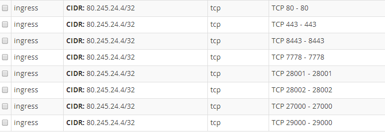

## #3 Configure Avamar Ports for backup and browsing for Open Cloud

The aim of this KB is to allow communication between your Avamar agent and our Cloud backup appliance.

* Go "Firewalling" section on the left panel

* Select the "Security Group" where Instances you want to backup are bound on (if there are numerous one)

* Add "ingress" rules from 80.245.24.4/32 for each ports as show below:

