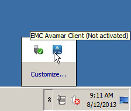
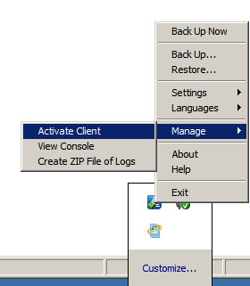
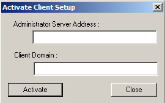
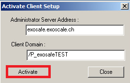
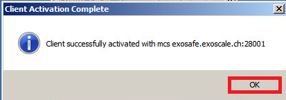

## #4 Register Avamar Client Agent

### Pre-requisites 

 - Windows Avamar client

### Active Client Agent

* On Windows system tray, Right click on the Avamar Client

* Click "Manage" and select "Activate Client"

* Add Administration Server Address and Client Domain

* Administration Server: exosafe.exoscale.ch

For example 
 
* Client Domain (Avamar Domain): /P_exosafeTEST (provided by email)

* Click on Activate button

* Click on OK button

