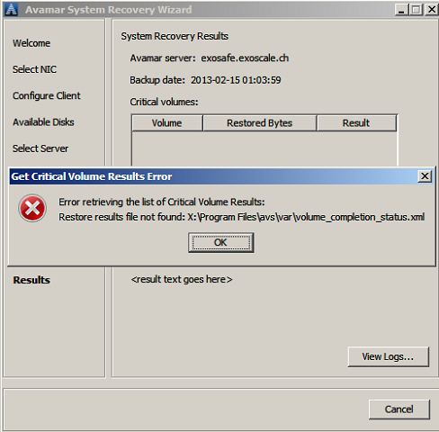

## Bare Metal Recovery for Open Cloud

* Windows BMR

Windows BMR capabilities and limitations:

This solution provides several Avamar features to simplify BMR of Windows Server 
2008, Windows Server 2012 / R2, Windows 7, or Windows 8 client machines

The WinPE ISO is available with 64-bit version.

Avamar provides BMR from physical machine to physical machine, as well as virtual 
machine to virtual machine.

N.B.: 

1) Avamar Windows Disaster Recovery is not supported for volumes encrypted with 
BitLocker Drive Encryption.

2) Recovery will fail to initialize and format the disk when the restore system’s 
disk size is different than the initial backup system disk size, even though the restore 
system’s disk size is sufficient for the disaster recovery backup data. 
All target disks on the restore system need to be as large as the original disks. After disaster recovery, 
there may be some unallocated space. This extra space can be used by extending the 
partition after the DR.

We highly recommend to choose exactly the same disk size as the initial one.

Follow these steps to proceed :

* Create an Instance using Exoscale Open Cloud UI or API

PS : Hard disk size must be at least the same as the source (we recommend you to put the same size in order to avoid errors)

* Using the Cloudstack API, mount the Avamar BMR ISO

http://cloudstack.apache.org/api/apidocs-4.4/user/attachIso.html

ISO name : "Avamar-BMR-VirtIO-Light"

* Power on your VM and open the console

* Select the right date / time and time zone

Click on Next button

* Load the Network Driver

Navigate to "D:\VirtIO_drivers\NetKVM\amd64\"

Select "netkvm.inf" and click "Open"

Click on Next button

* Fill in fields with your parameters

Select "Use the following IP Address"

Host Name: Name of the target Instance

DNS Domain: Name of your domain (if exist)

IP Address: Instance address IP as shown on the UI

Subnet Mask: 255.255.252.0

Default Gateway: 185.19.28.1

Select "Use the following DNS server addresses"

DNS Server Preferred: 8.8.8.8	

DNS Server Alternate: 8.8.4.4

Click on Next button

* Load the Storage Driver

Navigate to "D:\VirtIO_drivers\viostor\amd64\"

Select "viostor.inf" and click "Open"

Click on Next button

* Fill in fields with your Exoscale backup credentials (provided by email)

Avamar Server: exosafe.exoscale.ch

Avamar User Name: OpenCloud_xxx_xxx_Admin

Avamar Password: xxxxxxxxxxxxxxxxxx

Avamar Domain: OpenCloud_xxx_xxx

Avamar Account: /OpenCloud_xxx_xxx/YourAvamarClient

- Replace x with your information
- YourAvamarClient correspond to your VM name registered on your Avamar Domain

Click on Next button. 

* Select a backup in the list

Click on Next button

* Check the volume summary

PS: it's highly recommended to perform a quick format

Click on Next button

* System Recovery Summary

Click on Restore button and tick the case to confirm then click OK.

* Recovery is being performed

* Success Recovery

Reboot to finalise the restore. Your new system will boot automatically.

* Miscellaneous

If you get this error. 

That means, disaster recovery have failed to initialize and format the disk.

It happen if the target system disk size is less than the source backup system disk size. 

[http://exosafe.exoscale.ch]: http://exosafe.exoscale.ch

