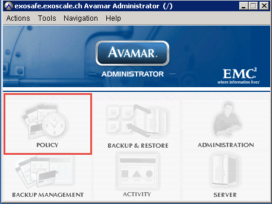
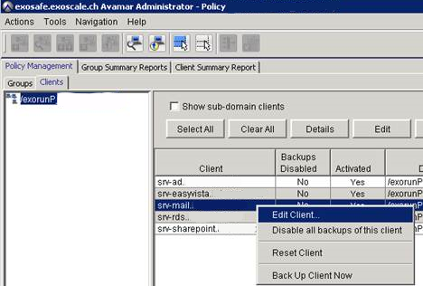
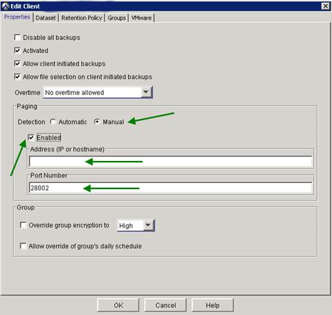
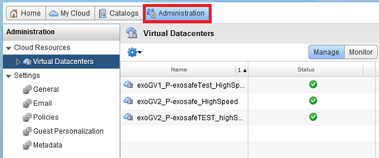
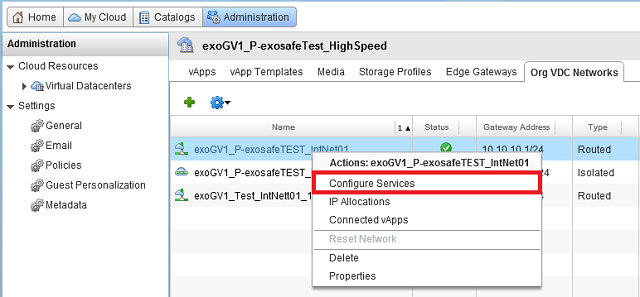
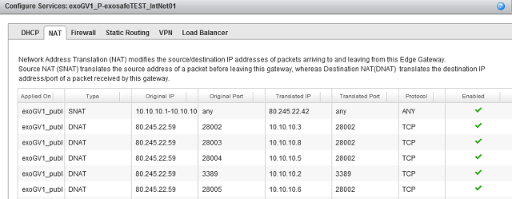
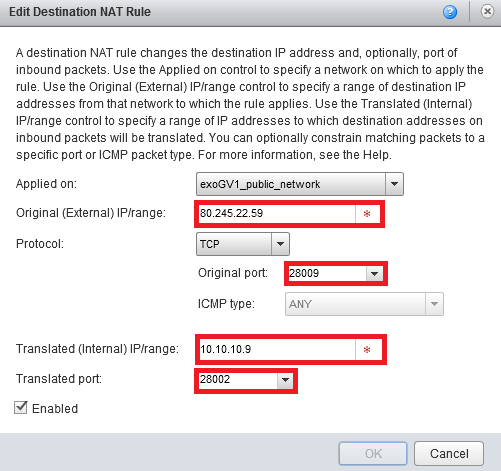
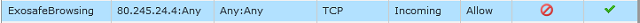

## Paging for Exoscale Managed Cloud

From Avamar Console click on "Policy". 

Select the "Clients" tab, right click on a client and click on Edit Client

* In Paging area, select Manual and tick Enabled

* In Address field add you own public IP

* In Port Number field, add the port 28002 and increment this port number for your other servers

* For example: 

                Srv-mail.xxxx.local: port 28002

                Srv-ad.xxxx.local: port 28003

                Srv-rds.xxxx.local: port 28004

* Be careful, this port number must be different for each server

* Click on OK button
 

## Add forwarding ports rule for exorun client

In Managed Cloud user interface, select Administration tab

* Select the tab, Org VDC Networks

* Right click your Virtual Datacenter and select Configure Services

* Click on NAT tab

* In this example, you must create port forwarding to enable paging

* Click on Add DNAT button

* Original(External) IP: your public IP

* Original port: Port number (must match to Avamar paging configuration)

* Translated (Internal) IP: Local IP of the VM

* Translated Port: 28002

## Firewall rules

The only one Incoming rule should be:

Exoscale Avamar Server IP: 80.245.24.4

