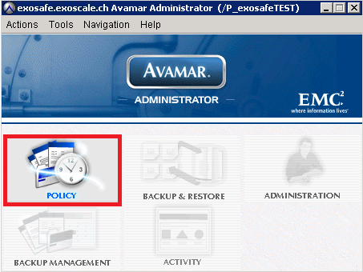
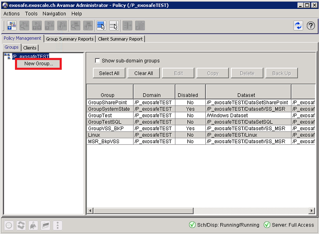
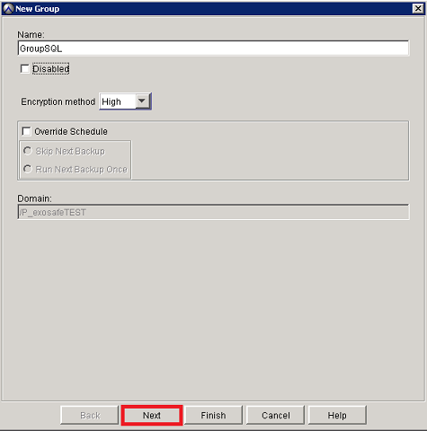
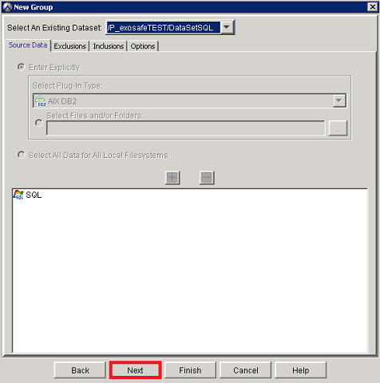
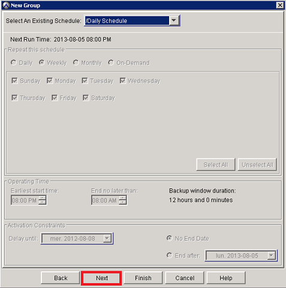
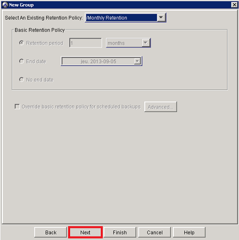
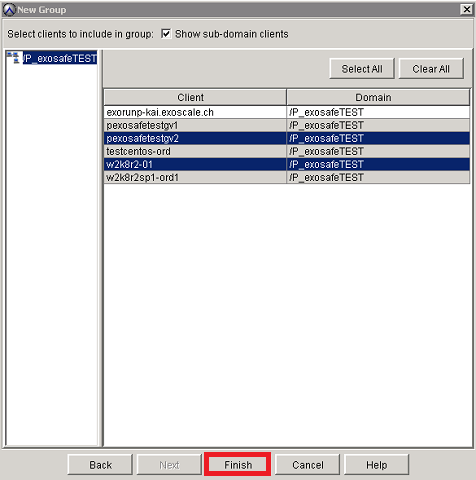
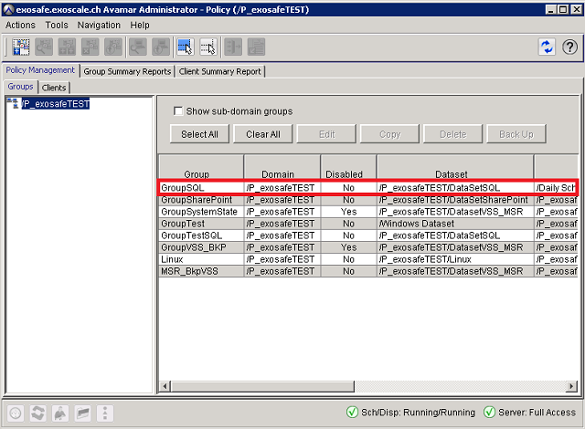

## Configure Backup Policy

* Introduction

Avamar uses groups to implement various policies to automate backups and enforce 
consistent rules and system behavior across an entire segment, or group, of the user 
community.

* Create a backup policy

Click on Policy in the Avamar console

Select the Groups tab

Select the Avamar domain to which the group should belong and right click on it

Right click on New Group

Add the name of your group

Untick Disabled to immediately enable regularly scheduled client backups for the new group

Click on Next 

Select an existing dataset for the group

Click on Next 

Select an existing schedule for the group

Click on Next 

Select an existing retention policy for the group

Click on Next 

Select clients for your group (Hold CTRL to select numerous one)

Click on Finish 

New group policy appears in your domain group

