## Configure Reports

* Introduction

The Avamar reports feature enables you to create, manage, and run system reports. When 
Avamar reports are run, the results appear in a separate dialog box. The report results can 
also be exported as a Comma-Separated Values (CSV) text file.

* Create a report

Open Avamar console

Click on Tools tab and select Manage Reports

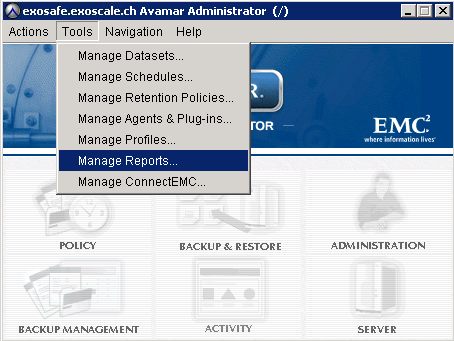

Click on New button to create a report

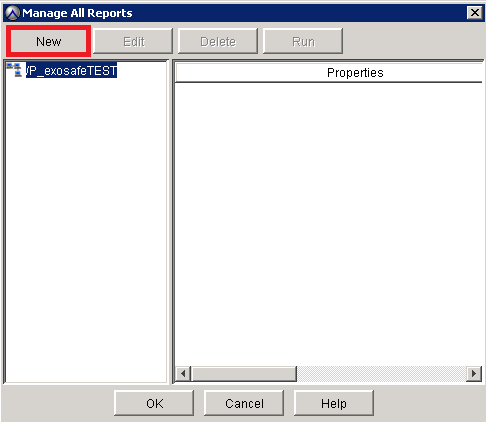

Add a Name, a Title and a Description to your report

From the Report View and Settings you can select:

Activities
Clients
Replication Activities
Backend Capacity

In your case we have selected Activities

Click on Ok button

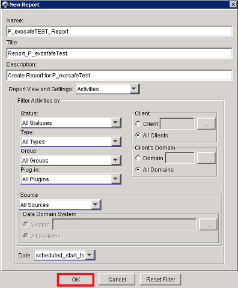

Select the report

Click on Run button to launch the Run Report dialog box

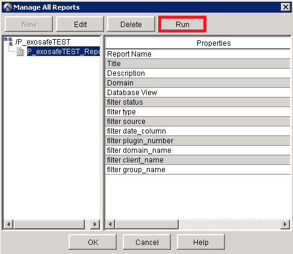

Select the date from and the date to for your report

Click on Retrieve button

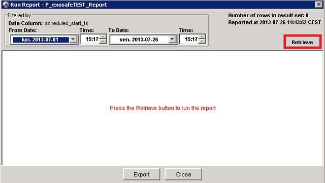

The report is display

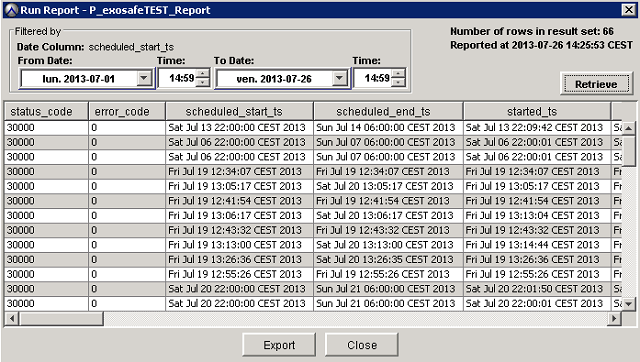

* Export a report

Click on Export button

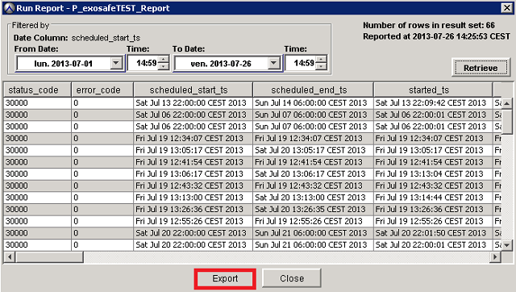

Add a file name to your export file and click on Save button

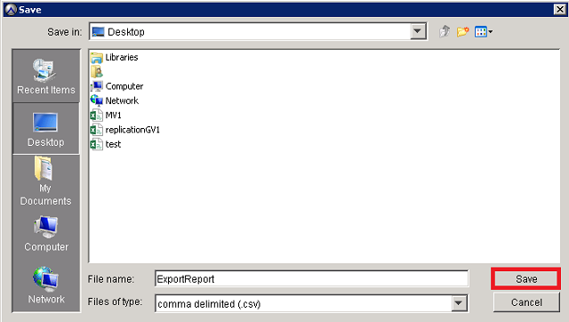

Open Excel

Click on Data tab

Select Get External Data

Click on From Text

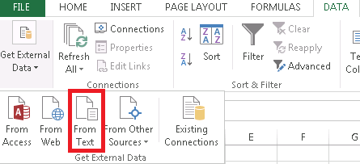

Select your export report and click on Import button

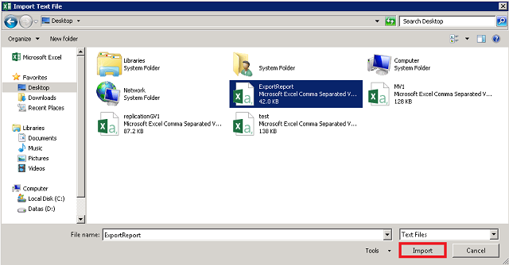

Select Delimited (commas or tabs separate each field)

Click on Next button

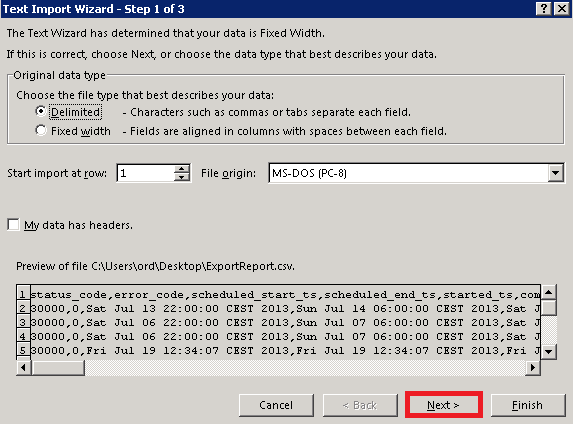

Select Tab and Comma

Click on Next button

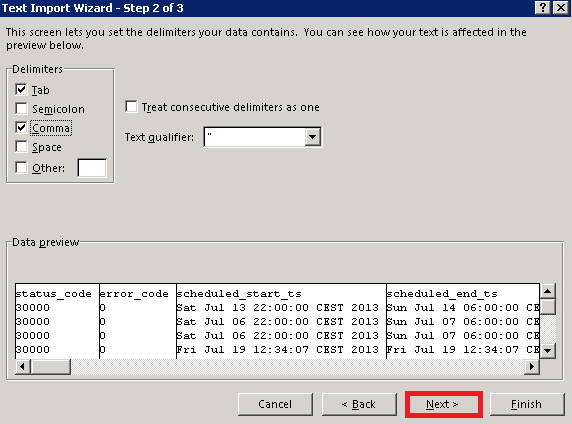

Click on Finish button

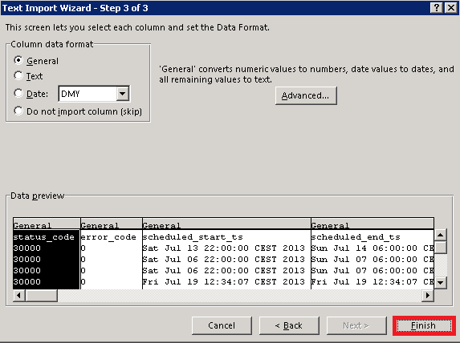

Report is displayed in Excel

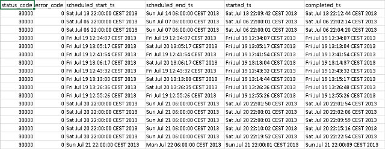

