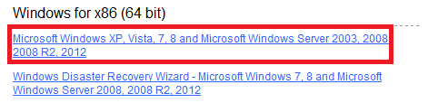
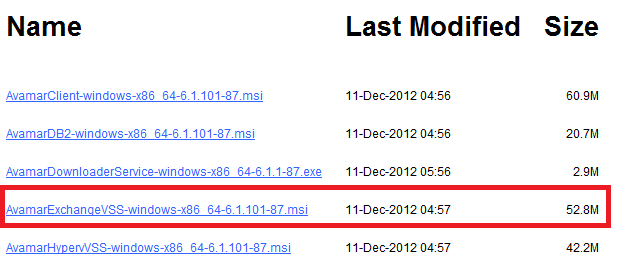
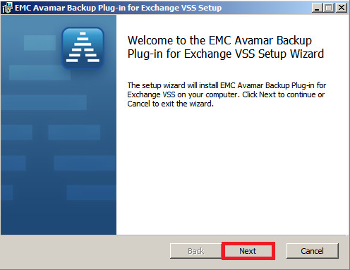
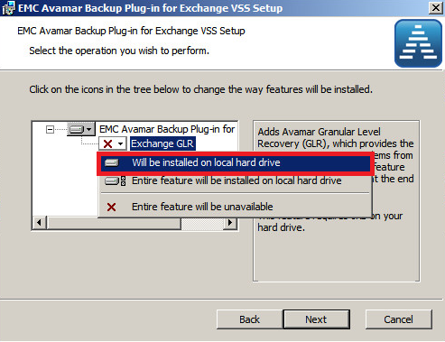
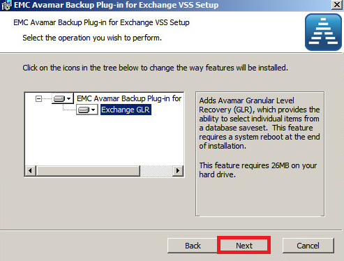
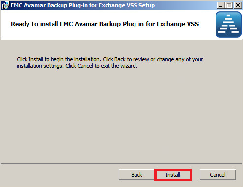
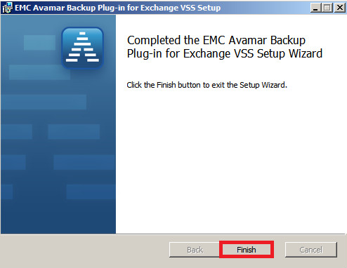

## Install Avamar Client Exchange

* Open a web browser and type your Avamar Server URL.

* In our case, it’s: [http://exosafe.exoscale.ch]

* Scroll down and then click on Documents and Downloads hyperlink.

* Under "Windows for x86" (32 bit or 64 bit)

* Click on the related link to proceed, as shown below (64 bit for instance )

* Click on AvamarExchangeVSS link to download the file

* Launch *.msi file downloaded

* After that, click on Next 

* Click on the red cross to install the GLR feature

* Select "Will be installed on local hard drive"

* Click on Next 

* Click on Install 

* Click on Finish button to close the wizard

[http://exosafe.exoscale.ch]: http://exosafe.exoscale.ch
