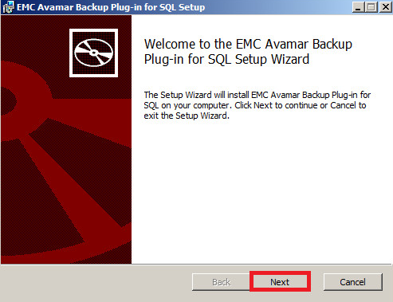
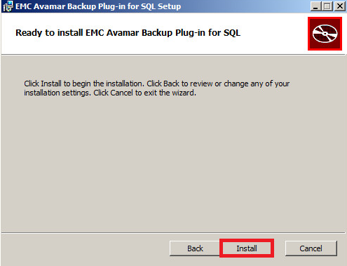
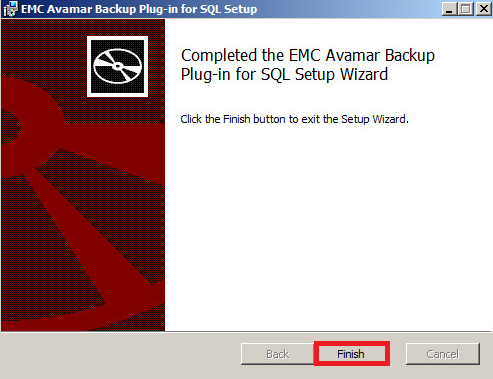

## Install or Update Avamar Client SQL

* Open a web browser and go to [http://exosafe.exoscale.ch]

* Scroll down and then click on "Documents and Downloads"

* Select your Windows version (64 bit or 32 bit) and click on Windows XP link

Click on AvamarSQL link to download the file

* Launch the *.msi file

* Click on Next

Click on Install button

Click on Finish button to close the wizard

[http://exosafe.exoscale.ch]: http://exosafe.exoscale.ch

