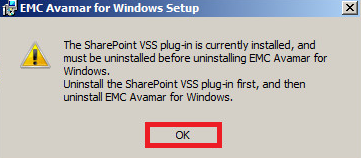
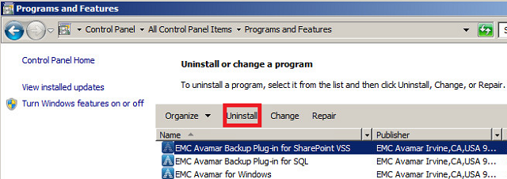
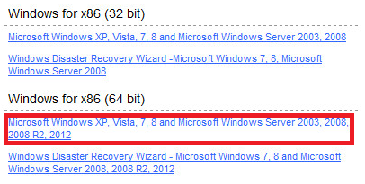
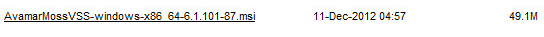
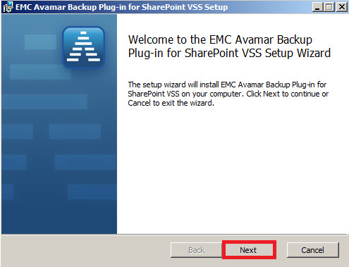
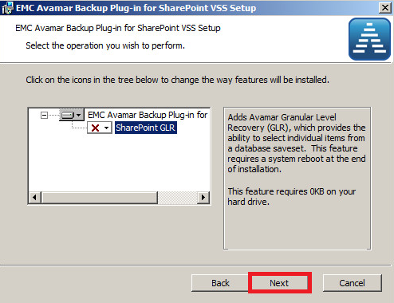
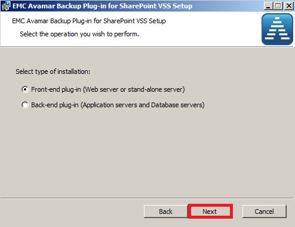
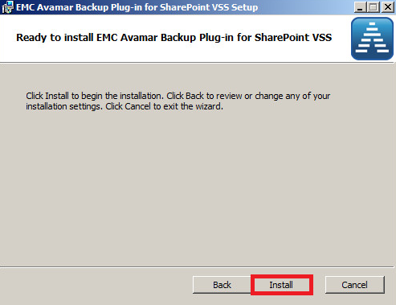
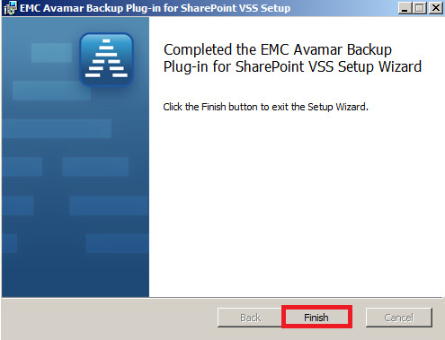

## Install or Update Avamar Client SharePoint Server

* In order to update you must uninstall the Sharepoint Client

Use "Windows Control Panel", "Programs and Features", to proceed click on EMC Avamar Backup Plug-in for SharePoint VSS

* Open a web browser and go to [http://exosafe.exoscale.ch]

* Scroll down and then click on "Documents and Downloads"

* Select your Windows version (64 bit or 32 bit) and click on Windows XP link

Click on AvamarMossVSS link to download the file

* Launch the *.msi file

* Click on Next 

Click on Next 

* Select your type of installation. In our case, it’s a Front-end plug-in and validate by clicking Next

To proceed click on Install 

Then click on Finish 

[http://exosafe.exoscale.ch]: http://exosafe.exoscale.ch

