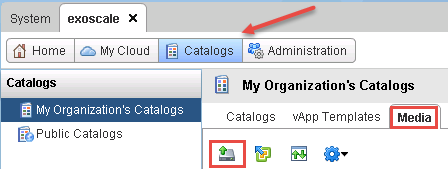
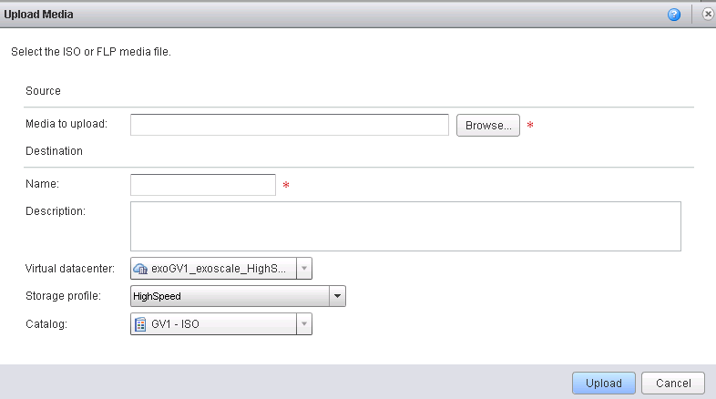
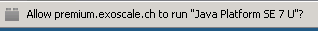
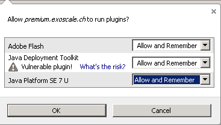
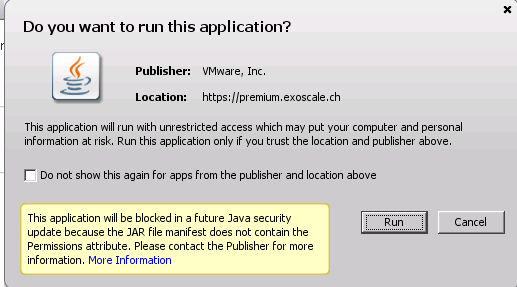
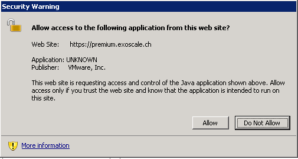
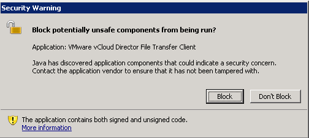
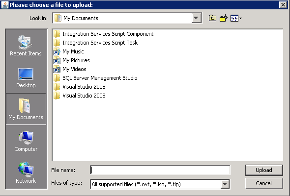
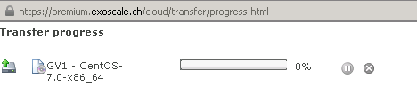

You can import ISO and OVF file for creating new instances. 

To proceed please follow these instructions:

### Go to your Organization's Catalog:

* Click on "Media" or "vApp Templates" tab
* Click on first icon (drive with green arrow)

A window "Upload Media" will pop up 

* Click on "Browse"

Depending on your JAVA security parameters, a warning will appear from your browser under URL bar

* Click "Allow" and set the authorizations as shown bellow

A Warning will pop up

* Click "Run"

A Warning will pop up

* Click "Allow"

A Warning will pop up

* Click "Don't block"

A Window "Please choose a file to upload" will pop up

* Browse your computer and click upload

* Set a Name
* Set a description
* Select the vDC that will host the ISO
* Select a storage profile
* Select the Catalog
* Click upload

A transfer progress window will pop up

PS: Exoscale provide vApp Templates and ISO, check it on the public Catalog. You are able to use it by performing a right click and select "Copy to Catalog"
