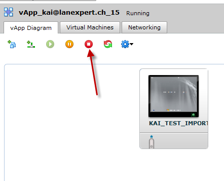
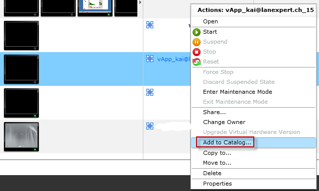
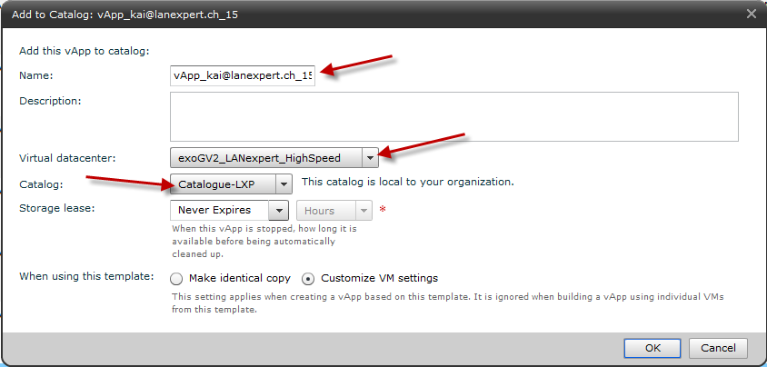
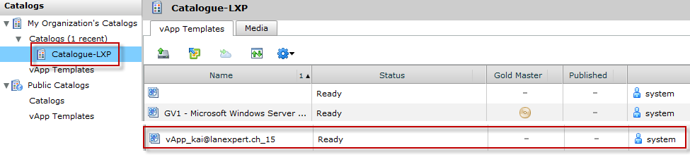

You can re-use your vApp or instance repeatedly as a template for creating new instances. 

To proceed please follow these instructions:

 

### Stop your vApp:

### Add the stopped vApp to catalog:

### Configure your vApp template:

* Set a Name
* Select the vDC that will host the vApp Template
* Select the Calatog
* Select the type of Template: Identical copy = Clone, Customize VM setting -> VMtools are needed

### You will find the vApp Template in your Catalog:

